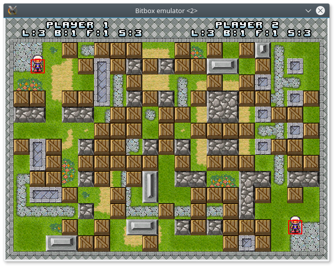

#BomberMan for BitBox#
------------------

This is a quick port of the classic Bomberman game on the BitBox console. The initial state is a bit raw, it is playable but there is no sound, no scores, no help.

Lay bombs to blow up your oponent without blowing up yourself ! Along the way you'll find bonuses to either extend the bomb dammage range or lay more bombs at once...

BitBox:
http://bitboxconsole.blogspot.fr
https://github.com/makapuf/bitbox

##Compile & Run##
To compile it, just type in make in the root directory. Do not forget to export BITBOX env var that points to the bitbox SDK.
Go there http://bitboxconsole.blogspot.fr/2013/09/tutorial-developing-for-bitbox-basics.html to get bitbox SDK environement setup.

##Licence##
    This program is free software: you can redistribute it and/or modify
    it under the terms of the GNU General Public License as published by
    the Free Software Foundation, either version 3 of the License, or
    (at your option) any later version.

    This program is distributed in the hope that it will be useful,
    but WITHOUT ANY WARRANTY; without even the implied warranty of
    MERCHANTABILITY or FITNESS FOR A PARTICULAR PURPOSE.  See the
    GNU General Public License for more details.

    You should have received a copy of the GNU General Public License
    along with this program.  If not, see <http://www.gnu.org/licenses/>.
